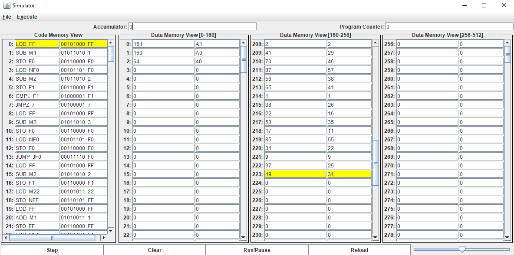

# CPU-Simulator
A CPU simulator in Java - The final project for CS 140 Programming with Objects and Data Structures at Binghamton University

The simulator can assemble files of its own mock assembly language into executable files, then run said files while showing the machine instructions and the state of the virtual memory.

*merge.pexe loaded into the simulator*

Run Mediator.java in the projectview package to start the simulator.
